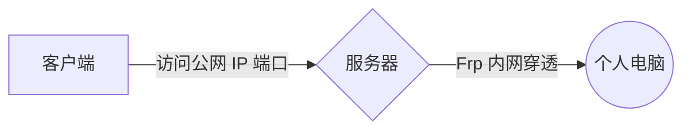

---
categories:
- 服务器
date: 2024-09-21 19:59:29.891454
id: home_server
tags:
- 服务器
title: 搭建家庭服务器
url: posts/home_server
---

时隔多年，又开始折腾服务器了。这次想在家里摆个服务器，就用淘汰下来的笔记本，花了两三天时间，遂记录一下。

# 万事始于公网 IP

还得是公网 IP。但令我没想到的是，打电话给电信，刚开口说想申请个公网 IP，人家就给我下了订单，我提前想好的理由一句没说。没半个小时一个电话过来，让我检查下 OK 不 OK——太效率了！
电信，赞！

# 路由器拨号

<!-- more -->

光有公网 IP 还不行，还得配置光猫桥接，让路由器拨号。

这一点要吐槽电信了，打电话第一个客户说不支持桥接，问原因她也不说，就说不支持——骗鬼呢。

打了第二个电话，换了个客户，还说不支持，但说了原因，大意是改桥接问题很多，很多年前就取消了这项服务。

我不是没想过自己去改，但是我家那个光猫型号老，后台（80 端口）以及管理后台（8080 端口）都没有改桥接的地方，我不知道是不是要超级管理员账号才能改，但超级管理员密码我也拿不到，电信客户也不给，问就是“没有”、“不知道”。

最后还是电信维修师傅帮忙改的桥接，也是光速改，很快啊。赞！

# 清理笔记本数据

笔记本虽然之前应该备份过数据，但以防万一，还是又备份了一遍。

两台笔记本摆一起，连上 WIFI，开启 Windows 文件共享，选好想备份的文件等它传好就完事了。

# 选择 Linux 发行版

虽然这笔记本是当服务器来使，365 天不停机，但还是得给它安排桌面版 Linux 系统，毕竟家里爸妈放电视剧、电影还得靠它。

选 Linux 发行版时给我纠结了一下，Linux Mint 和 Manjaro 其实都很好。

- Linux Mint 优势在于它是 Ubuntu 系的，很多开源软件基本第一个要支持的就是 Ubuntu，特别是那种一键式安装脚本，对 OS 依赖较强，支持的也一般包含 Ubuntu。装 Ubuntu 绝对省心。
- Manjaro 优势就在于有 AUR，基本什么软件都能很方便的安装，虽然每次安装都要编译就是了。

最终还是选了 Manjaro。

# 安装 Linux 系统

制作启动盘一开始用的软碟通，最后发现没法启动。后面又换了 Refus，使用 DD 模式刻录，才成功。

# Linux 系统配置

## 代理配置

代理是个大问题。

在国内，连 Github 很多时候都不好使，AUR 根本没法发挥它的威力，必须先搞好代理。

### Xray

Xray 在 Linux 上没什么好的 GUI 软件，**[Qv2ray](https://github.com/Qv2ray/Qv2ray)** 也不再维护了，遂决定直接使用原生软件 + 配置文件去弄了。

先用 Windows 上的 v2rayN 将现有的代理服务器导出为客户端配置，再上传到笔记本上。将 Xray 程序下载好一并上传上去，配好 systemctl。

```
vim /etc/systemd/system/xray.service
```

```
[Unit]
# 服务名称
Description = xray client
After = network.target syslog.target
Wants = network.target

[Service]
Type = simple
# 启动命令
ExecStart = xray -c /usr/local/xray/xray.json
#User=xray_tproxy
#Group=xray_tproxy

[Install]
WantedBy = multi-user.target
```

然后启动并设成开机自启。

```
systemctl start xray
systemctl enable xray
```

完事。

### 使用代理

如何让进程，如 yay 走代理？

#### 透明代理

透明代理是个好主意，一开始也在研究这条路子，但是它容易把服务器的网络搞乱。这台服务器我还需要那来做内网穿透、反向代理，如果弄了透明代理，到时候出些奇奇怪怪的问题，那就非常难定位了。

但我还是小研究了一下，

```bash
$ cat /etc/systemd/system/tproxyrule.service 
[Unit]
Description=tproxy rule
After=network.target
Wants=network.target

[Service]
Type=oneshot
RemainAfterExit=yes
# 注意分号前后要有空格
ExecStart=/usr/bin/bash /usr/local/xray/config_iptables.sh
ExecStop=/sbin/ip rule del fwmark 1 table 100 ; /sbin/ip route del local 0.0.0.0/0 dev lo table 100 ; /sbin/iptables -t mangle -F
# 如果是 nftables，则改为以下命令
# ExecStart=/sbin/ip rule add fwmark 1 table 100 ; /sbin/ip route add local 0.0.0.0/0 dev lo table 100 ; /sbin/nft -f /etc/nftables/rules.v4
# ExecStop=/sbin/ip rule del fwmark 1 table 100 ; /sbin/ip route del local 0.0.0.0/0 dev lo table 100 ; /sbin/nft flush ruleset

[Install]
WantedBy=multi-user.target
```

```bash
$ cat /usr/local/xray/config_iptables.sh
#!/usr/bin/bash

# 设置策略路由
ip rule flush table 100
ip rule add fwmark 1 table 100 
ip route add local 0.0.0.0/0 dev lo table 100

iptables -t mangle -F

# 代理局域网设备
iptables -t mangle -N V2RAY
iptables -t mangle -A V2RAY -d 127.0.0.1/32 -j RETURN
iptables -t mangle -A V2RAY -d 224.0.0.0/4 -j RETURN 
iptables -t mangle -A V2RAY -d 255.255.255.255/32 -j RETURN 
iptables -t mangle -A V2RAY -d 192.168.0.0/16 -p tcp -j RETURN # 直连局域网，避免 V2Ray 无法启动时无法连网关的 SSH，如果你配置的是其他网段（如 10.x.x.x 等），则修改成自己的
iptables -t mangle -A V2RAY -d 192.168.0.0/16 -p udp ! --dport 53 -j RETURN # 直连局域网，53 端口除外（因为要使用 V2Ray 的 DNS)
iptables -t mangle -A V2RAY -p udp -j TPROXY --on-ip 127.0.0.1 --on-port 12345 --tproxy-mark 1 # 给 UDP 打标记 1，转发至 12345 端口
iptables -t mangle -A V2RAY -p tcp -j TPROXY --on-ip 127.0.0.1 --on-port 12345 --tproxy-mark 1 # 给 TCP 打标记 1，转发至 12345 端口
iptables -t mangle -A PREROUTING -j V2RAY # 应用规则

# 代理网关本机
iptables -t mangle -N V2RAY_MASK 
iptables -t mangle -A V2RAY_MASK -d 224.0.0.0/4 -j RETURN 
iptables -t mangle -A V2RAY_MASK -d 255.255.255.255/32 -j RETURN 
iptables -t mangle -A V2RAY_MASK -d 192.168.0.0/16 -p tcp -j RETURN # 直连局域网
iptables -t mangle -A V2RAY_MASK -d 192.168.0.0/16 -p udp ! --dport 53 -j RETURN # 直连局域网，53 端口除外（因为要使用 V2Ray 的 DNS）
iptables -t mangle -A V2RAY_MASK -m owner --gid-owner 23333 -j RETURN
iptables -t mangle -A V2RAY_MASK -p udp -j MARK --set-mark 1   # 给 UDP 打标记，重路由
iptables -t mangle -A V2RAY_MASK -p tcp -j MARK --set-mark 1   # 给 TCP 打标记，重路由
iptables -t mangle -A OUTPUT -j V2RAY_MASK # 应用规则
```

基本参考的 Xray、V2ray 的 Wiki，通过 iptables 实现，将流量转至 Xray 的透明代理。

这里并非完整配置，想使用还得去看 Xray、V2ray 的 Wiki。

#### 环境变量

最后使用了临时配环境变量的方式，想使用代理时就 `source set_proxy`。

```bash
$ cat /usr/bin/set_proxy 
#!/usr/bin/bash

export {http,https,ftp,rsync,all}_proxy=http://127.0.0.1:10809
export {HTTP,HTTPS,FTP,RSYNC,ALL}_PROXY=http://127.0.0.1:10809
git config --global http.proxy 'http://127.0.0.1:10809'
git config --global https.proxy 'http://127.0.0.1:10809'
```

## Chrome

有了代理，这就简单，

```
yay -S google-chrome
```

装完浏览器，如何让浏览器走代理？很简单，使用 SwitchyOmega 扩展程序。

没代理，访问不了 Chrome 扩展商店？使用以下命令启动浏览器，就可使用代理。

```
google-chrome-stable --proxy-server=http://127.0.0.1:10809
```

装好后 SwichyOmega 后导入配置。

```
{"+Steam":{"color":"#4477bb","defaultProfileName":"direct","name":"Steam","profileType":"SwitchProfile","revision":"17d5754e689","rules":[{"condition":{"conditionType":"HostWildcardCondition","pattern":"*steam*"},"profileName":"V2Ray"},{"condition":{"conditionType":"HostWildcardCondition","pattern":"*github*"},"profileName":"V2Ray"},{"condition":{"conditionType":"HostWildcardCondition","pattern":"*google*"},"profileName":"V2Ray"}]},"+V2Ray":{"bypassList":[{"conditionType":"BypassCondition","pattern":"127.0.0.1"},{"conditionType":"BypassCondition","pattern":"[::1]"},{"conditionType":"BypassCondition","pattern":"localhost"}],"color":"#dd6633","fallbackProxy":{"host":"127.0.0.1","port":10808,"scheme":"socks5"},"name":"V2Ray","profileType":"FixedProfile","revision":"17289fa9d65"},"-addConditionsToBottom":false,"-confirmDeletion":true,"-downloadInterval":1440,"-enableQuickSwitch":false,"-monitorWebRequests":true,"-quickSwitchProfiles":[],"-refreshOnProfileChange":true,"-revertProxyChanges":true,"-showExternalProfile":true,"-showInspectMenu":true,"-startupProfileName":"","schemaVersion":2}
```

完事。

## 输入法

输入法我搞了半天，都 2024 年了，Linux 桌面端配个输入法这么为难。当然，其实还是因为对 Linux 桌面不了解，走了很多弯路，不然不至于搞这么久。

[Fcitx5 - Arch Linux 中文维基 (archlinuxcn.org)](https://wiki.archlinuxcn.org/wiki/Fcitx5)

Arch Wiki 里写得很详细，按照这个来就行。我装的 Manjaro Xfce 版，使用的还是 X11 协议，Wayland 部分的都不用管。

# SSH 配置

因为桌面端要用，所以 Root 密码定然不能复杂，但想远程 SSH 登录，就要把 SSH 端口暴露倒公网，简单的密码肯定不行。

所以需要禁用密码登录，只能使用密钥登录。

```
vim /etc/ssh/sshd_config
```

```
PermitRootLogin prohibit-password
PasswordAuthentication no
PubkeyAuthentication yes
```

顺便开启 X11 Forward，

```
X11Forwarding yes
X11UseLocalhost no
```

启动 SSHD。

```
systemctl start sshd
systemctl enable sshd
```

# Sunshine 远程桌面

远程桌面还是要的，因为爸妈的看电视剧需要，有时需要我远程去帮他们调整一下电脑。

这个就直接使用 Sunshine + Moonlight 了，没太多计较，能用就行。

# Frp 内网穿透

我另外有一台电脑，在另一个城市，在内网。我希望它也能远程，可以通过家里具有公网 IP 的笔记本服务器做端口映射，如此在外网访问笔记本服务器特定端口，就能映射倒内网的另一台电脑。



# 路由器端口映射

最后，再把相应的端口映射倒公网，就 OK。
